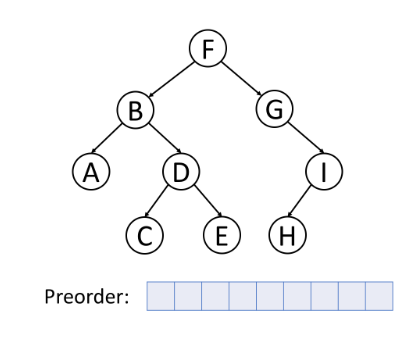

## Traverse A Tree

소개에서 트리와 이진 트리의 개념에 대해 살펴보았다.

이 챕터에서는, 이진 트리에서 사용되는 순회 방법에 대해 포커싱할 것이다. 이러한 순회 방법들을 이해하는 것은 확실히 자료 구조를 더 잘 이해하고 앞으로의 공부에 탄탄한 기초를 가지는 데 도움이 될 것이다.

이 챕터의 목표는

1. 다른 트리 순회 방법들의 차이점을 이해한다.
2. 전위, 중위, 후위 순회를 재귀적으로 풀 수 있다.
3. 전위, 중위, 후위 순회를 반복적으로 풀 수 있다.
4. BFS를 사용하여 레벨 순회를 할 수 있다.

 

### Traverse a Tree - Introduction

#### Pre-order Traversal

전위 순회는 루트 노드를 먼저 방문하는 것이다. 그러고 나서 왼쪽 트리를 순회한다. 마지막으로 오른쪽 트리를 순회한다.

위 트리에서 전위 순회를 할 시, 순회 순서는 F → B → A → D → C → E → G → I → H가 된다.

#### In-order Traversal

중위 순회는 왼쪽 트리를 먼저 순회하고, 루트를 방문한다. 마지막으로 오른쪽 트리를 방문한다.

위 트리에서 중위 순회를 할 시, 순회 순서는 A → B → C → D → E → F → G → H → I가 된다.

일반적으로 이진 탐색 트리에서 중위 순회를 사용하여 정렬된 순서로 모든 데이터를 검색할 수 있다. 이는 다른 카드 이진 탐색 트리에서 다시 한 번 더 언급할 것이다.

#### Post-order Traversal

후위 순회는 왼쪽 트리를 먼저 순회하고, 오른쪽 트리를 방문한 뒤, 마지막으로 루트를 방문한다.

위 트리에서 후위 순회를 할 시, 순회 순서는 A → C → E → D → B → H → I → G → F가 된다.

트리에서 노드들을 삭제할 때, 삭제는 후위 순회로 처리된다. 말하자면, 노드를 삭제할 때, 자신의 노드를 삭제하기 전에 왼쪽 자식을 삭제하고 오른쪽 자식을 삭제할 것이다.

또한, 후위 순회는 수학적 표현에서 널리 사용된다. 후위 순회로 표현하는 것이 프로그램을 쓰기에 더 쉽기 때문이다. 다음 예시를 살펴보자.

너는 중위 순회를 사용하면 원래 표현을 더 쉽게 알아낼 수 있다. 하지만, 프로그램에서는 연산의 순서를 확인해야 하기 때문에 이 표현을 처리하는 것이 쉽지 않다. 이 트리를 후위 순회로 처리하게 된다면 스택을
이용하여 간단하게 표현식을 처리할 수 있을 것이다. 연산자를 만날 때마다, stack에서 2개의 요소를 pop할 수 있고, 그 결과를 계산해서 다시 스택에 push할 수 있다.

#### Recursive or Iterative

다음 예제들에서 3개의 다른 순회 방식을 연습하라. 너는 아마 이 방식들을 재귀적으로나 반복적으로나 구현하고 싶을 것이다. 양쪽 모두의 방법으로 구현해보고 그들의 차이점을 비교하라.

 

---

### Level-order Traversal - Introduction

레벨 순서 순회은 트리를 레벨마다 순회하는 것이다.

`Breadth-First Search`(너비 우선 탐색)은 트리나 그래프 같은 자료 구조에서 순회하거나 탐색하기 위한 알고리즘이다. 알고리즘은 루트 노드에서부터 시작해서 자신의 노드를 먼저 방문한다. 그리고 이웃
노드들을 순회하고, 그 다음 레벨의 이웃을, 그 다음 레벨의 이웃을 순회하는 식이다.

트리에서 너비 우선 탐색을 할 때 방문했던 노드들의 순서는 레벨 순서가 된다.

여기 레벨 순서 순회의 예시를 보면

위 트리에서 레벨 순서로 순회할 시 순회 순서는 F → B → G → A → D → I → C → E → H가 된다.

일반적으로 BFS를 할 때는 큐를 사용한다. 만약 큐 자료 구조에 익숙하지 않다면 큐와 스택 카드에서 공부할 수 있다.

