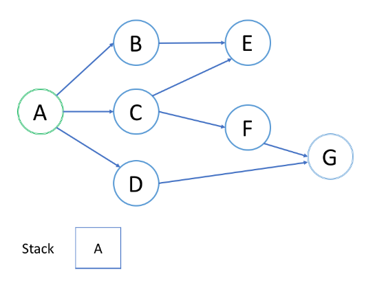

## Stack and DFS

선행: 트리 순회

BFS와 비슷하게, `깊이 우선 탐색(depth-first search, DFS)`는 트리나 그래프에서 순회하거나 탐색하는 또 다른 중요한 알고리즘이다.
이 또한, 더 추상적인 시나리오들에서 사용가능하다.

트리 순회에서 언급했다시피, `전위`, `중위`, `후위` 순회를 위해 DFS를 사용할 수 있다.
이 세 개의 순회들 사이에는 공통점이 있다.
`가장 깊은 노드에 도달하기 전까지 다시 거슬러 올라가지 않는다는 것이다.`

또한 DFS와 BFS의 가장 큰 차이점은 `BFS는 현재 레벨의 모든 노드를 방문하기전까지 절대 더 깊이 가지 않는다는 것이다.`

일반적으로, DFS는 `재귀`를 사용하여 구현한다. Stack은 재귀에서 중요한 역할을 한다.
이 챕터에서는 재귀를 사용할 때의 스택의 역할에 대해서 설명할 것이다.
또한 DFS를 구현할 때 재귀를 이용한 것과 `재귀를 이용하지 않은 것`에 대한 단점을 살펴볼 것이다.

DFS는 면접을 준비할 때 중요한 주제이다. DFS의 실제 디자인은 문제마다 다양하다.
이 챕터는 어떻게 DFS에 스택이 적용되는지, 스택이 DFS의 원리를 이해하는데 어떻게 도움이 되는지에 대해 초점을 맞출 것이다.
DFS 알고리즘을 마스터하기 위해 많은 연습문제를 풀어봐야 할 것이다.

<br>

BFS와 비슷하게 `깊이 우선 탐색(Depth-First Search, DFS)`는 루트 노드에서 타겟 노드까지의 길을 찾기 위해 사용된다.
이 article에서는, DFS가 어떻게 작동하는지, 스택이 DFS에 어떻게 이용되는지 스텝별로 설명하는 예제를 제공한다.

<br>

---

### An Example

다음은 루트 노드 A에서 타겟 노드 G까지의 경로를 DFS로 찾는 예제이다.



[예제 영상 링크](https://leetcode.com/explore/learn/card/queue-stack/232/practical-application-stack/1377/)

<br>

---

### Insights

위 예제 영상을 본 후, 다음 질문들에 대답하라.

<br>

#### 1. 노드의 처리 순서는 어떻게 되는가?

위의 예제에서, 루트 노드 `A`에서 시작한다.
첫번째로, `B` 노드로 가는 길을 선택하고 더 깊이 가지 못하는 `E` 노드까지 도착하면 다시 되돌아온다.
노드 `A`로 되돌아오고, 다시 노드 `C`로의 두 번째 경로를 고른다.
`C`에서, `E`로 가는 첫번째 경로로 가고자 하지만, `E`는 이미 방문한 노드이다.
따라서, `C`로 되돌아가고 `F`로의 다른 경로를 시도한다.
드디어 `G`를 찾는다.

대체로, `가장 깊은` 노드에 도달한 후에`만` 다른 길을 선택하거나 다시 되돌아온다.

```text
결과적으로, DFS에서 찾은 첫번째 경로는 가장 짧은 경로는 아니다.
예를 들어, 위의 예제에서 `A -> C -> F -> G` 경로를 찾았고 DFS를 멈췄지만,
이는 `A`에서 `G`로 가는 가장 짧은 경로는 아니다.
```

<br>

#### 스택의 push와 pop의 순서는 어떻게 되는가?

위의 애니메션에서 봤다시피, 처음에 스택에 루트 노드를 push한다.
그 후, 먼저 이웃 노드 `B`를 시도한 후 스택에 노드 `B`를 push한다.
가장 깊은 노드 `E`에 도달하면, 다시 되돌아간다.
되돌아 갈때 스택에 push되었던 `가장 마지막 노드`인 `가장 깊은 노드를 pop`한다.

노드는 스택에 `추가되는` 것과 `정확히 반대되는 순서`로 처리된다.
이는 Last-in-First-out(LIFO)이고 이것이 DFS에서 stack을 사용하는 이유이다.

<br>

---

## DFS - Template 1

챕터에서 언급했다시피, 대부분의 경우에서 BFS를 사용할 때 DFS를 사용하기도 한다.
둘의 중요한 차이점이 있다면 `순회 순서`이다.

BFS와는 다르게, `더 일찍 방문한 노드들은 루트 노드에 더 가까운 노드들이 아니다`.
결과적으로, DFS에서 발견한 첫번째 경로는 `가장 짧은 경로가 아닐 수 있다`.

이 article에서는, DFS의 재귀 템플릿을 제공하고, 이 과정에서 stack이 이떻게 쓰이는지를 보여줄 것이다.
그 후, 연습할 수 있도록 이 article 이후에 몇 가지 예제를 제공할 것이다.

<br>

---

### Template - Recursion

DFS를 구현하는데는 두 가지 방법이 있다. 첫 번째는 이미 친숙한 재귀를 이용하는 방식이다.
다음은 참고로 제공하는 템플릿이다.

```java
/*
 * Return true if there is a path from cur to target.
 */
boolean DFS(Node cur,Node target,Set<Node> visited){
        return true if cur is target;
        for(next:each neighbor of cur){
        if(next is not in visited){
        add next to visited;
        return true if DFS(next,target,visited)==true;
        }
        }
        return false;
        }
```

DFS를 재귀적으로 구현할 때 스택을 사용할 필요가 없어 보일 수도 있다.
하지만 실제로는, `콜 스택으로 알려져 있는` 시스템이 제공하는 내부 스택을 사용하게 된다.

<br>

---

### An Example

한 예제를 살펴보자. 아래에 있는 그래프에서 노드 0과 노드 3 사이의 경로를 찾으려고 한다.
옆의 그림은 각 호출마다의 스택의 상태를 표현한 것이다.


각 스택의 요소는 다음이 있다.
Integer `cur`, Integer `target`, 배열 `visited`, 배열 `edges`.
이들은 DFS 함수가 가지고 있는 매개변수들과 정확히 일치한다.
위의 스택에서는 `cur`만 보여주고 있다.

각 요소들은 상수 공간을 차지한다.
그러므로 스택의 크기는 정확히 DFS의 깊이이다.
따라서 worst case에서 시스템 스택을 유지하기 위해서는 DFS의 최대 깊이가 h라고 할 때, O(h)가 소비된다.
공간 복잡도를 계산할 때, 시스템 스택을 고려하는 것을 잊지 마라.

```text
위의 템플릿에서, 첫 번째 경로를 찾고 멈췄다.
만약 가장 짧은 경로를 찾고 싶다면?
Hint: 이미 발견한 가장 짧은 경로를 나타내는 하나의 매개변수를 더 추가하라.
```

<br>

---

## DFS - Template 2

재귀 풀이의 장점은 구현하기 보다 쉽다는 것이다. 그러나 큰 단점이 있는데 만약 재귀의 깊이가 너무 높다면,
`stack overflow`로 고통받을 수 있다는 것이다. 이 경우, BFS를 사용하거나 내부 스택을 사용하여 DFS를 구현할 수 있다.

아래는 내부 스택을 사용한 템플릿이다.

```java
/*
 * Return true if there is a path from cur to target.
 */
boolean DFS(int root,int target){
        Set<Node> visited;
        Stack<Node> stack;
        add root to stack;
        while(stack is not empty){
        Node cur=the top element in stack;
        remove the cur from the stack;
        return true if cur is target;
        for(Node next:the neighbors of cur){
        if(next is not in visited){
        add next to visited;
        add next to stack;
        }
        }
        }
        return false;
        }
```

이 논리는 정확히 재귀 풀이와 같다.
하지만 재귀 중 시스템 콜 스택을 시뮬레이션하기 위해 `while` 루프와 `스택`을 사용한다.